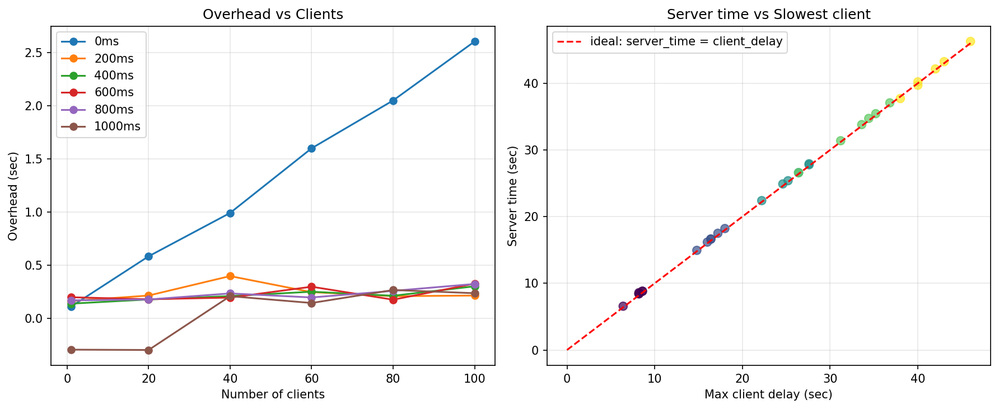

# Task 4

Запуск

```bash
./runme.sh
```

Результаты статистики в `result.txt` после прогона:

```
clients delay_ms server_time_sec max_client_delay_sec overhead_sec
1 0 0.113 0 0.113
20 0 0.585 0 0.585
40 0 0.993 0 0.993
60 0 1.601 0 1.601
80 0 2.051 0 2.051
100 0 2.606 0 2.606
1 200 6.565 6.4 0.165
20 200 8.416 8.2 0.216
40 200 8.599 8.2 0.399
60 200 8.448 8.2 0.248
80 200 8.81 8.6 0.21
100 200 8.816 8.6 0.216
1 400 14.94 14.8 0.14
20 400 16.179 16 0.179
40 400 16.611 16.4 0.211
60 400 16.652 16.4 0.252
80 400 18.214 18 0.214
100 400 17.503 17.2 0.303
1 600 22.4 22.2 0.2
20 600 25.381 25.2 0.181
40 600 26.597 26.4 0.197
60 600 24.899 24.6 0.299
80 600 27.777 27.6 0.177
100 600 27.928 27.6 0.328
1 800 26.571 26.4 0.171
20 800 31.379 31.2 0.179
40 800 35.436 35.2 0.236
60 800 33.798 33.6 0.198
80 800 37.06 36.8 0.26
100 800 34.725 34.4 0.325
1 1000 37.707 38 -0.293
20 1000 39.704 40 -0.296
40 1000 40.21 40 0.21
60 1000 42.146 42 0.146
80 1000 46.268 46 0.268
100 1000 43.238 43 0.238
```

График по статистике выше через скрипт `analyze_resulsts.py`. Для запуска нужны библиотеки: 
- `numpy`
- `matplotlib`
- `pandas`

Если установлен uv, то можно быстро запустить:

```shell
uv run python analyze_results.py
```



### Наблюдения

- при delay = 0 с ростом клиентов растет оверхед, и это нормально, так как суммируется время выполнения
 `connect/send/recv/disconnect`, а простоя клиента нет. По сути оверхед равен времени работы сервера
- при delay != 0 наблюдаем прямую линию не зависимо от количества клиентов и задержки — стабильно около 200 ms.
 Сервер работает асинхронно
- Наблюдаются случаи, когда время работы сервера < времени работы самого долго клиента. Скорее всего это вызывано тем, 
 что `usleep` может иногда засыпать на меньший период. А так как сумма `total_delay` в клиенте идет по переданному 
 параметру `--delay=200` то и насчитаться может больше чем в реальности
- Правый график показывает прямо пропорциональную зависимость времени работы сервера от максимального времени работы
 клиента

### Замечания 

- в runme.sh запускается один сервер на все тестирование: при этом для каждого набора параметров `clients_сount` и
 `delay` проверяется что после работы состояние сервера равно нулю.
- Также во втором этапе runme.sh есть проверка, что куча сервера не растет, за счет того что аллокаций памяти 
 практический нет
- По умолчанию у сервера размер пула 100 клиентов. Эту константу можно поменять в `server.c`
- 

